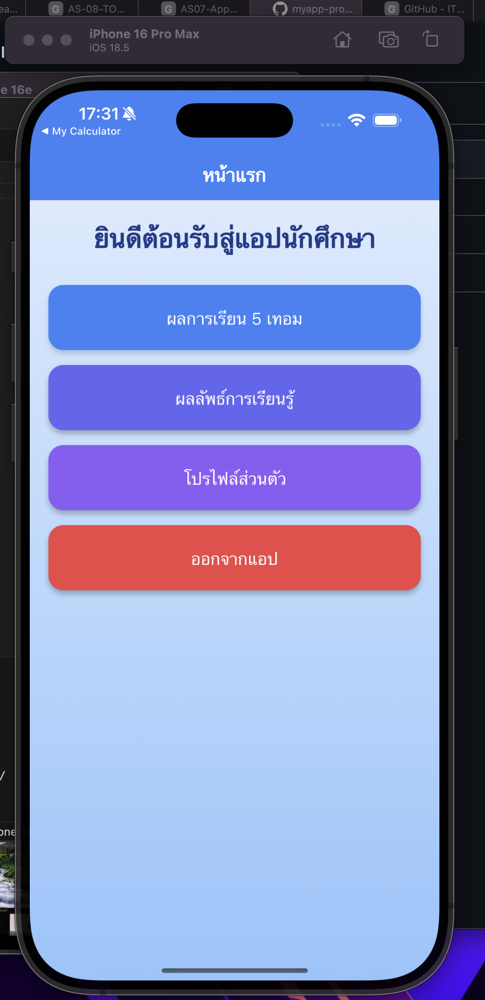
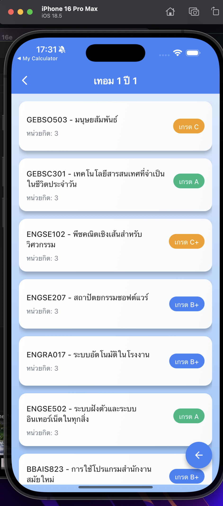
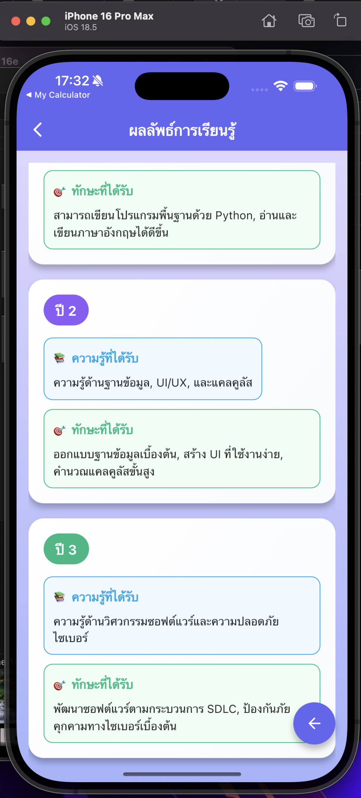
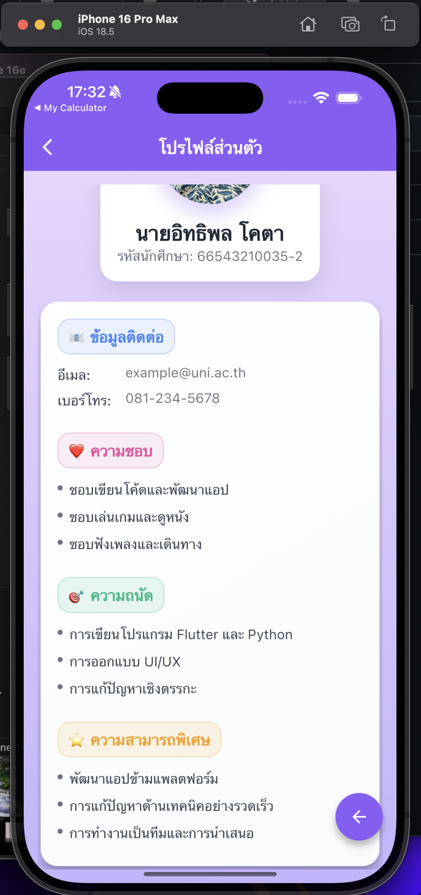

# 📱 MyApp Profile (Flutter)
## อิทธิพล โคตา 66543210035-2

แอป **โปรไฟล์ส่วนตัว** ที่พัฒนาด้วย Flutter รองรับ iOS/Android
แสดง/แก้ไขข้อมูลผู้ใช้ เช่น รูปโปรไฟล์ ชื่อ อีเมล เบอร์โทร Bio ทักษะ และลิงก์โซเชียล
ออกแบบเลย์เอาต์ให้ใช้งานง่าย ตัวอักษรอ่านสบาย (Kanit) และรองรับ Dark/Light

---

## 🚀 ฟีเจอร์หลัก

- แสดงข้อมูลโปรไฟล์: ชื่อ, อีเมล, เบอร์โทร, Bio, ที่อยู่, ทักษะ (Skills)
- แก้ไขข้อมูลโปรไฟล์แบบ **Inline / BottomSheet Editor**
- อัปโหลด/เปลี่ยน **รูปโปรไฟล์ (Avatar)** จากแกลเลอรี
- ค้นหาทักษะ / เพิ่ม-ลบทักษะ
- คัดลอกอีเมล/เบอร์โทร หรือเปิดลิงก์โซเชียลได้ทันที
- บันทึกข้อมูลถาวรด้วย **SharedPreferences** (สามารถเปลี่ยนเป็น SQLite ได้ภายหลัง)
- ธีม **Material 3** + ฟอนต์ **Kanit** (google_fonts)
- รองรับหน้าจอแนวตั้ง/แนวนอน และแท็บเล็ต

---

## 🛠️ ขั้นตอนการพัฒนา

### โครงสร้าง Model
- `UserProfile` : `{ name, email, phone, bio, address, avatarPath, skills[] }`
- `SocialLink`  : `{ github, facebook, instagram, website }`

### การจัดการ State
- ใช้ **Provider** สร้าง `ProfileProvider` จัดการ:
  - โหลดข้อมูลจาก Storage `loadProfile()`
  - บันทึก `saveProfile()`
  - แก้ไขฟิลด์ต่าง ๆ และแจ้ง `notifyListeners()`

### Storage Service
- `ProfileStorage` (SharedPreferences)
  - `getProfile()`, `setProfile()`
  - เก็บ path ของรูปโปรไฟล์ และข้อมูลพื้นฐาน
- ถ้าต้องการใช้ **SQLite** ให้สร้าง `profile_db.dart` (ตาราง `profile`, `skills`)

### เลย์เอาต์
- `ProfileScreen`: แสดงภาพรวม + ปุ่มแก้ไข
- `EditProfileSheet`: แบบฟอร์มแก้ไขชื่อ/อีเมล/โทร/Bio/ลิงก์
- `SkillChips`: แสดงทักษะเป็น Chip เพิ่ม/ลบได้
- รองรับ `SafeArea` และใช้ `ListView` เพื่อเลื่อนในจอเล็ก

---

## ▶️ วิธีใช้งาน (จุดสำคัญ)

- **แก้ไขข้อมูล**: กดปุ่ม “แก้ไข” → ปรากฏฟอร์ม → บันทึก
- **เปลี่ยนรูปโปรไฟล์**: กดรูป Avatar → เลือกรูปจากแกลเลอรี
- **เพิ่มทักษะ**: กด “+ เพิ่มทักษะ” → พิมพ์แล้วกดบันทึก
- **เปิดโซเชียล**: แตะไอคอนเพื่อเปิดลิงก์ในเบราว์เซอร์
- **บันทึกถาวร**: ออกจากแอปแล้วกลับมา ข้อมูลยังอยู่

---

## 📸 Screenshot ผลลัพธ์

> วางรูปไว้ในโฟลเดอร์ `screenshots/` (แนะนำตั้งชื่อไฟล์ **ไม่มีช่องว่าง** เช่น `home.png`, `edit.png`, `avatar.png`)  
> **สำคัญ**: อย่าใส่ `` ไว้ใน code block (บล็อกพื้นเทา) ไม่งั้นรูปจะไม่แสดง

<p>
  
   <br>
   หน้าหลัก
   <br>
  
   <br>
   ผลการเรียน 5 เทอม
   <br>
  
  <br>
   ผลลัพท์การเรียนรู้
  <br>
   
   <br>
   โปรไฟล์ส่วนตัว
   <br>
</p>

---

## 📦 การติดตั้งและรัน

```bash
# Clone โปรเจกต์
git clone <repo-url>
cd myapp-profile

# ติดตั้ง dependency
flutter pub get

# สร้างไฟล์พื้นฐาน (ถ้ายังไม่ได้รันในโฟลเดอร์)
flutter create .

# รันบน emulator/device
flutter run
